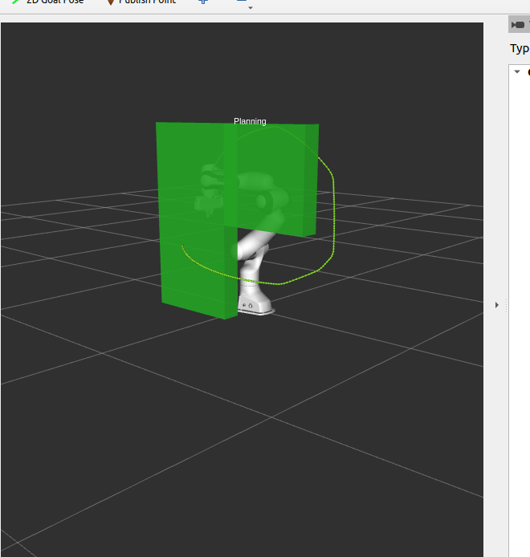
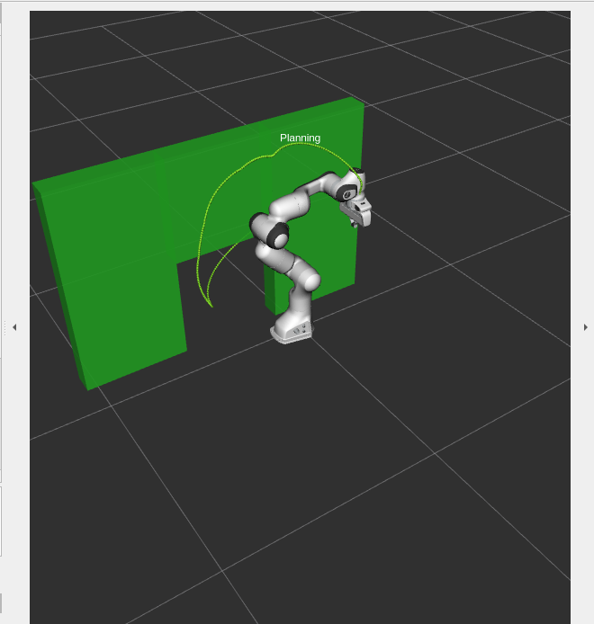

# Motion Planning with KDL and PickIK

## Experiment Summary
I tested motion planning performance with the Panda arm using different collision configurations and IK solvers (KDL and PickIK).

---

## 1. Two-Collision Setup
I added a second collision object to increase difficulty.  

- **Solver:** KDL  
- **Result:** Worked successfully without issues.  

---

## 2. Three-Collision “Boxed” Setup
I added a third collision object, effectively boxing in the robot to make the planning problem more difficult.  

- **Solver:** KDL  
- **Result:** Planning was more challenging. It eventually succeeded after 7 trials.  

---

## 3. Testing PickIK in the Boxed Setup
- **Solver:** PickIK  
- **Result:** Performance was significantly worse than KDL for this configuration.  
- I experimented with multiple parameter settings but couldn’t achieve consistent success.

---

## 4. Back to Two-Collision Setup with PickIK
Even when reverting to the easier two-collision setup, PickIK still failed in most cases despite trying many different parameter configurations.

---

## 5. Final Choice
I reverted to using **KDL**, which worked in both collision setups.
